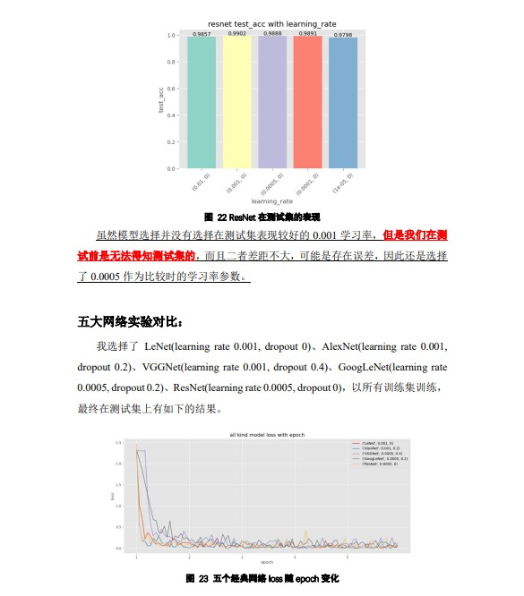

# 经典CNN架构

## 实验运行方法

各模型的py文件中仅包含此模型，main.py为主文件，compare.py用于比较各个模型（已选取最优参数），plot.py中整合了画图，方便调用

### main.py

参数--model 选定模型

参数--lr 学习率 可以多填

参数--dropout 可以多填

参数--plot 是否画图

参数--epoch 轮次

**示例：**

```powershell
python .\main.py --model googlenet --lr 0.001 0.0005 0.0001 --dropout 0 0.2 0.4 --plot true --epoch 5
```

### compare.py

内置了五个经典模型以及合适的学习率，运行以下代码即可

```powershell
python .\compare.py
```


## 介绍





## 参考文献：

 [1] Y. Lecun, L. Bottou, Y. Bengio and P. Haffner, "Gradient-based learning applied  to document recognition," in Proceedings of the IEEE, vol. 86, no. 11, pp. 2278- 2324, Nov. 1998, doi: 10.1109/5.726791. 

 [2] Krizhevsky, Alex et al. “ImageNet classification with deep convolutional neural  networks.” Communications of the ACM 60 (2012): 84 - 90. 

 [3] Simonyan, Karen and Andrew Zisserman. “Very Deep Convolutional Networks  for Large-Scale Image Recognition.” CoRR abs/1409.1556 (2015): n. pag. 

 [4] Szegedy, Christian et al. “Going deeper with convolutions.” 2015 IEEE  Conference on Computer Vision and Pattern Recognition (CVPR) (2015): 1-9. 

 [5] He, Kaiming et al. “Deep Residual Learning for Image Recognition.” 2016 IEEE  Conference on Computer Vision and Pattern Recognition (CVPR) (2016): 770-778. 

 [6] Zeiler, Matthew D. and Rob Fergus. “Visualizing and Understanding  Convolutional Networks.” ECCV (2014).
